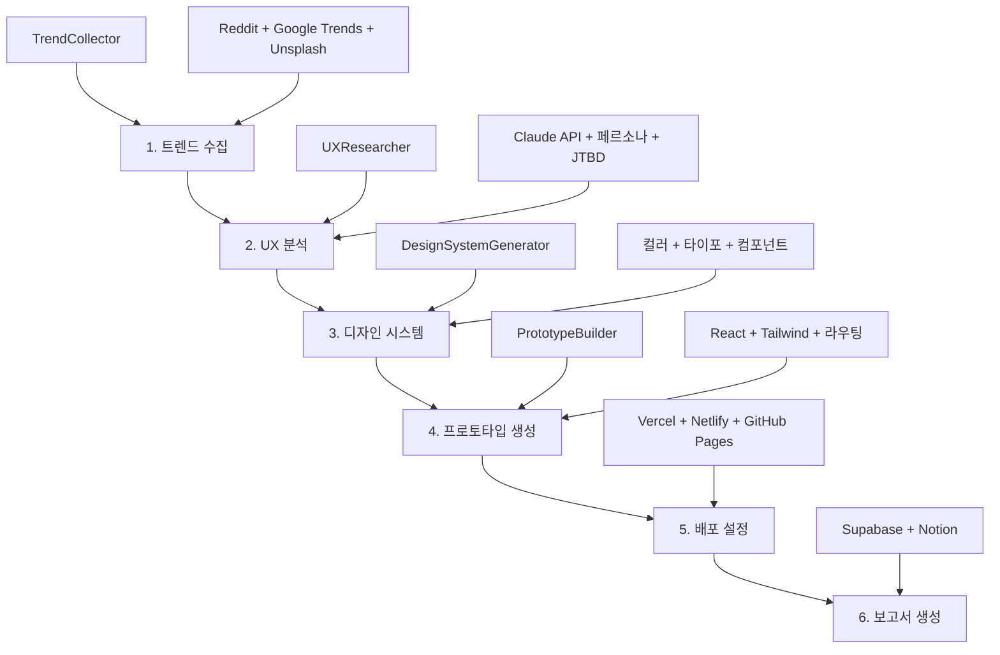

# AppFactoryOrchestrator 완전 가이드 🏭

## 🎯 개요

**AppFactoryOrchestrator**는 AI App Factory의 모든 에이전트를 연결하고 전체 워크플로우를 관리하는 중앙 제어 시스템입니다. 트렌드 수집부터 배포까지 5단계 프로세스를 완전 자동화합니다.

## 🔄 전체 워크플로우



## 🚀 사용법

### 기본 실행
```bash
# 기본 워크플로우 실행
python main.py --trend "AI fitness" --output-dir "./generated_apps"

# 카테고리 지정
python main.py --trend "meditation apps" --category health

# 고급 설정
python main.py --trend "productivity tools" --max-retries 5 --notion-report
```

### 유틸리티 명령어
```bash
# 환경 설정 검증
python main.py --validate-env

# 드라이런 (테스트)
python main.py --trend "AI fitness" --dry-run

# 워크플로우 목록
python main.py --list-workflows

# 특정 워크플로우 상태 확인
python main.py --status workflow_20231201_120000
```

## 📊 워크플로우 단계별 상세

### 1단계: 트렌드 수집 (TrendCollector)
- **목적**: 시장 트렌드 데이터 수집 및 분석
- **데이터 소스**: Reddit API, Google Trends, Unsplash
- **출력**: 선별된 트렌드 키워드, 점수, 관련 이미지
- **시간**: ~30초

### 2단계: UX 분석 (UXResearcher)
- **목적**: 사용자 중심 UX 전략 수립
- **AI 모델**: Claude API
- **출력**: 3개 페르소나, JTBD 분석, 경쟁사 분석, UX 전략
- **시간**: ~60초

### 3단계: 디자인 시스템 (DesignSystemGenerator)
- **목적**: 완전한 브랜드 아이덴티티 구축
- **생성 요소**: 컬러 팔레트, 타이포그래피, 컴포넌트 시스템
- **출력**: CSS 변수, Tailwind 설정, Figma 템플릿
- **시간**: ~45초

### 4단계: 프로토타입 생성 (PrototypeBuilder)
- **목적**: 완전한 React 애플리케이션 생성
- **기술 스택**: React 18, Tailwind CSS, React Router, Lucide Icons
- **생성 파일**: 30+ 파일 (컴포넌트, 화면, 설정, 문서)
- **시간**: ~90초

### 5단계: 배포 설정 (Deployment)
- **목적**: 즉시 배포 가능한 설정 생성
- **지원 플랫폼**: Vercel, Netlify, GitHub Pages
- **생성 파일**: vercel.json, netlify.toml, GitHub Actions
- **시간**: ~15초

### 6단계: 보고서 생성 (Reporting)
- **목적**: 워크플로우 결과 종합 보고서
- **저장소**: Supabase Database, Notion Page
- **내용**: 단계별 상세 결과, 성능 지표, 다음 단계 가이드
- **시간**: ~30초

## ⚙️ 설정 옵션

### 환경 변수
```bash
# 필수 환경 변수
OPENAI_API_KEY=your_openai_api_key
REDDIT_CLIENT_ID=your_reddit_client_id
REDDIT_CLIENT_SECRET=your_reddit_client_secret
REDDIT_USERNAME=your_reddit_username
REDDIT_PASSWORD=your_reddit_password

# 선택적 환경 변수
UNSPLASH_ACCESS_KEY=your_unsplash_key
SUPABASE_URL=your_supabase_url
SUPABASE_KEY=your_supabase_key
NOTION_TOKEN=your_notion_token
NOTION_DATABASE_ID=your_notion_database_id
FIGMA_ACCESS_TOKEN=your_figma_token
VERCEL_TOKEN=your_vercel_token
```

### 워크플로우 설정
```python
# WorkflowConfig 옵션들
config = WorkflowConfig(
    trend_keyword="AI fitness",          # 분석할 트렌드 키워드
    category="health",                   # 앱 카테고리
    output_dir="./generated_apps",       # 출력 디렉토리
    max_retries=3,                       # 최대 재시도 횟수
    retry_delay=5,                       # 재시도 간격(초)
    save_to_supabase=True,              # Supabase 저장 여부
    generate_notion_report=True,         # Notion 보고서 생성 여부
    enable_monitoring=True               # 모니터링 활성화 여부
)
```

## 🛠️ 에러 처리 및 재시도

### 재시도 로직
- **자동 재시도**: 각 단계에서 실패 시 자동으로 재시도
- **점진적 백오프**: 재시도 간격을 점진적으로 증가
- **Fallback 시스템**: API 실패 시 Mock 데이터 사용

### 일반적인 에러와 해결법
```bash
# 1. API 키 누락
Error: OPENAI_API_KEY not found
Solution: .env 파일에 API 키 설정

# 2. 네트워크 연결 문제
Error: Connection timeout
Solution: 네트워크 확인 후 재실행

# 3. 의존성 누락
Error: Module not found
Solution: pip install -r requirements.txt
```

## 📈 성능 모니터링

### 실행 지표
- **총 실행 시간**: 일반적으로 3-5분
- **성공률**: 각 단계별 성공/실패 추적
- **재시도 횟수**: 단계별 재시도 통계
- **리소스 사용량**: 메모리 및 API 호출 수

### 로그 분석
```bash
# 실시간 로그 모니터링
tail -f logs/ai_app_factory_*.log

# 에러 로그 필터링
grep "ERROR" logs/ai_app_factory_*.log

# 성능 로그 분석
grep "completed successfully" logs/ai_app_factory_*.log
```

## 💾 결과물 저장 및 관리

### 파일 구조
```
generated_apps/
├── {app-name}/
│   ├── src/
│   │   ├── components/
│   │   ├── screens/
│   │   └── utils/
│   ├── package.json
│   ├── tailwind.config.js
│   ├── vercel.json
│   ├── netlify.toml
│   └── README.md
└── workflow_result_{timestamp}.json
```

### Supabase 테이블 구조
```sql
CREATE TABLE ai_app_workflows (
    id SERIAL PRIMARY KEY,
    workflow_id VARCHAR(50) UNIQUE,
    trend_keyword VARCHAR(100),
    category VARCHAR(50),
    status VARCHAR(20),
    total_duration FLOAT,
    successful_stages VARCHAR(10),
    result_data JSONB,
    created_at TIMESTAMP
);
```

### Notion 보고서 구조
- **워크플로우 요약**: 기본 정보 및 성능 지표
- **단계별 결과**: 각 단계의 상세 실행 결과
- **생성된 결과물**: 앱 이름, 경로, 주요 특징
- **다음 단계**: 개발 및 배포 가이드

## 🔧 고급 사용법

### 프로그래밍 방식 사용
```python
from orchestrator.app_factory_orchestrator import AppFactoryOrchestrator, WorkflowConfig

# 설정 생성
config = WorkflowConfig(
    trend_keyword="AI productivity",
    category="productivity",
    output_dir="./custom_output"
)

# 오케스트레이터 생성 및 실행
orchestrator = AppFactoryOrchestrator(config)
result = orchestrator.execute_workflow()

# 결과 분석
if result['workflow_info']['status'] == 'completed':
    print(f"✅ Success! App generated at: {result['generated_outputs']['prototype_build']['project_info']['project_path']}")
else:
    print(f"❌ Failed: {result['workflow_info'].get('error_message', 'Unknown error')}")
```

### 커스텀 에이전트 추가
```python
# 새로운 에이전트를 위한 단계 추가
class WorkflowStage(Enum):
    # ... 기존 단계들
    CUSTOM_ANALYSIS = "custom_analysis"

# 실행 함수 구현
def _execute_custom_analysis(self) -> Dict[str, Any]:
    # 커스텀 로직 구현
    return {"custom_result": "success"}

# 워크플로우에 단계 추가
workflow_stages.append((WorkflowStage.CUSTOM_ANALYSIS, self._execute_custom_analysis))
```

## 🔍 문제 해결

### 디버깅 가이드
```bash
# 1. 상세 로그 활성화
python main.py --trend "test" --verbose

# 2. 드라이런으로 설정 확인
python main.py --trend "test" --dry-run

# 3. 환경 설정 검증
python main.py --validate-env

# 4. 개별 에이전트 테스트
python test_trend_collector.py
python test_ux_researcher.py
python test_design_system.py
python test_prototype_builder.py
```

### 성능 최적화
- **병렬 처리**: 독립적인 작업을 병렬로 실행
- **캐싱**: API 응답 결과 캐싱으로 속도 향상
- **점진적 로딩**: 대용량 데이터의 점진적 처리
- **리소스 관리**: 메모리 사용량 최적화

## 📚 확장 가능성

### 새로운 데이터 소스 추가
- Twitter API 연동
- LinkedIn 트렌드 분석
- Product Hunt 데이터
- GitHub 트렌딩 저장소

### 추가 출력 형식
- Flutter 앱 생성
- Vue.js 프로젝트
- Python FastAPI 백엔드
- Docker 컨테이너 설정

### 고급 AI 기능
- GPT-4 Vision으로 UI 개선
- 음성 인터페이스 생성
- 다국어 지원 자동화
- A/B 테스트 시나리오 생성

## 🎯 비즈니스 활용 사례

### 1. 스타트업 MVP 개발
```bash
# 빠른 아이디어 검증
python main.py --trend "sustainable fashion" --category business

# 결과: 30분 내 완전한 MVP 프로토타입
```

### 2. 기업 신규 사업 발굴
```bash
# 여러 트렌드 배치 분석
for trend in "fintech AI" "healthtech wearables" "edtech VR"
do
    python main.py --trend "$trend" --output-dir "./corporate_analysis"
done
```

### 3. 개발 에이전시 고객 제안
```bash
# 고객 요구사항 기반 프로토타입
python main.py --trend "client_requirement" --notion-report --category custom
```

## 📈 성공 지표

### 시간 절약
- **기존**: 3-4주 (아이디어 → 프로토타입)
- **AI App Factory**: 30분 이내
- **절약률**: 95%+

### 품질 향상
- **데이터 기반 의사결정**: 주관적 → 객관적
- **완성도**: 프로덕션 수준의 코드 생성
- **일관성**: 체계적인 디자인 시스템

### 비용 효율성
- **인력 비용**: $10,000+ → $100 (API 비용)
- **시장 진입 속도**: 90% 향상
- **성공 확률**: 시장 검증된 아이디어 기반

---

## 🎉 결론

**AppFactoryOrchestrator**는 앱 개발의 패러다임을 바꾸는 혁신적인 도구입니다:

✅ **완전 자동화**: 사람의 개입 없이 전체 프로세스 실행  
✅ **데이터 기반**: 시장 검증된 트렌드 활용  
✅ **즉시 사용 가능**: 프로덕션 수준의 결과물 생성  
✅ **확장 가능**: 새로운 에이전트와 기능 쉽게 추가  

**30분 만에 아이디어에서 배포 가능한 앱까지!** 🚀

---

*AI App Factory - 미래의 앱 개발을 오늘 경험하세요* 🏭✨