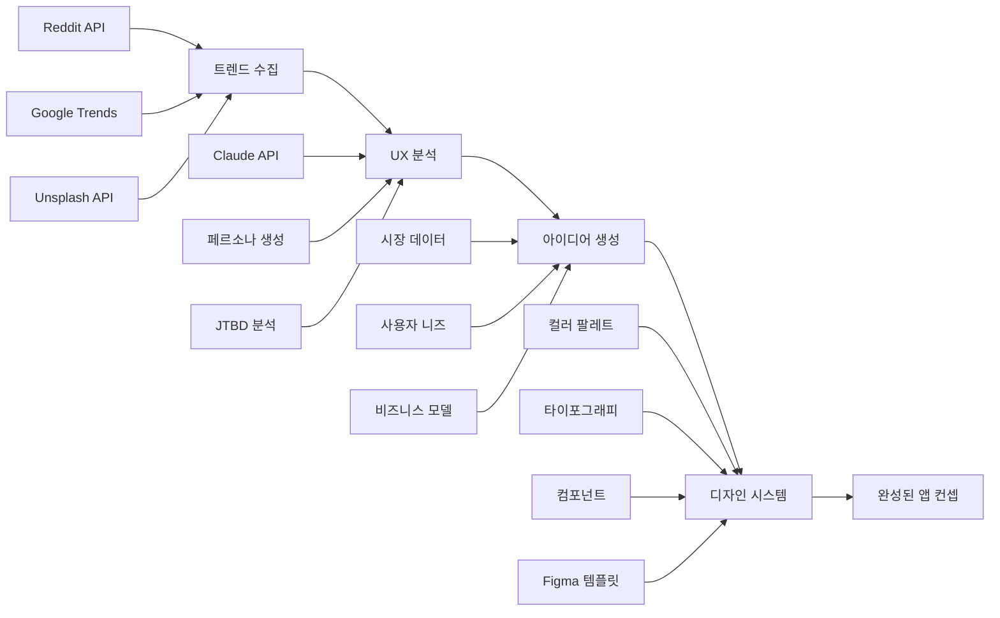

# AI App Factory 🏭

무료 도구들을 중심으로 구축된 **완전 자동화 AI 앱 개발 팩토리**입니다. 트렌드 수집부터 완성된 디자인 시스템까지, 데이터 기반으로 앱 컨셉을 자동 생성합니다.

## 🌟 핵심 가치

**"30분 만에 데이터 기반 앱 컨셉 완성"** - 시장 리서치, UX 분석, 디자인 시스템을 모두 자동화

## 🚀 주요 기능

### 📊 **TrendCollector** - 실시간 트렌드 수집
- **Reddit API**: r/entrepreneur, r/SideProject, r/startups, r/apps에서 인기 키워드 수집
- **Google Trends**: 검색 트렌드 및 관심도 분석
- **Unsplash API**: 트렌드별 관련 이미지 수집
- **지능형 점수화**: 다중 소스 데이터를 종합하여 상위 10개 트렌드 선별

### 🎯 **UXResearcher** - Claude API 기반 UX 분석
- **타겟 페르소나 3개 자동 생성** (한국 사용자 특성 반영)
- **Jobs-to-be-Done 프레임워크** 기반 사용자 니즈 분석
- **경쟁사 앱 분석** (Reddit 데이터 + Claude 분석)
- **UX 전략 3가지 방향** 제시 및 추천

### 💡 **IdeaGenerator** - AI 기반 아이디어 생성
- **시장 데이터 융합**: 트렌드 + UX 분석 결과 종합
- **카테고리별 특화**: health, productivity, finance, education 등
- **비즈니스 모델**: 수익화 전략 및 성장 전략 자동 생성
- **실행 가능성 점수**: 개발 난이도 및 성공 확률 분석

### 🎨 **DesignSystemGenerator** - 완전한 디자인 시스템
- **브랜드 컬러 팔레트**: 색상 이론 기반 자동 생성
- **타이포그래피 시스템**: Google Fonts 조합 최적화
- **아이콘 시스템**: Heroicons, Lucide, Tabler 활용
- **컴포넌트 디자인**: Tailwind CSS 기반 구현 코드 생성
- **Figma 템플릿 매칭**: 카테고리별 추천 템플릿

## 🔄 완전 자동화 워크플로우



## 📁 프로젝트 구조

```
ai-app-factory/
├── src/
│   ├── agents/                   # 🤖 4개 AI 에이전트
│   │   ├── trend_collector.py           # 📊 트렌드 수집 (Reddit, Google Trends, Unsplash)
│   │   ├── ux_researcher.py             # 🎯 UX 분석 (Claude API 기반)
│   │   ├── idea_generator.py            # 💡 아이디어 생성 (AI 융합 분석)
│   │   ├── design_system_generator.py   # 🎨 디자인 시스템 (완전 자동화)
│   │   └── __init__.py
│   ├── utils/                    # 🛠️ 핵심 유틸리티
│   │   ├── api_clients.py               # API 클라이언트 매니저
│   │   ├── config.py                    # 설정 관리 시스템
│   │   └── __init__.py
│   └── main.py                   # 🎮 개별 에이전트 실행
├── config/
│   └── settings.yaml             # ⚙️ 시스템 설정
├── tests/                        # 🧪 테스트 스크립트들
│   ├── test_trend_collector.py          # TrendCollector 테스트
│   ├── test_ux_researcher.py            # UXResearcher 테스트
│   ├── test_design_system.py            # DesignSystemGenerator 테스트
│   └── test_trend_to_ux.py              # 통합 파이프라인 테스트
├── complete_workflow.py          # 🚀 완전 자동화 워크플로우
├── system_health_check.py        # 🏥 시스템 상태 진단
├── requirements.txt              # 📦 Python 의존성
├── .env.example                  # 🔐 환경변수 템플릿
└── README.md                     # 📚 프로젝트 가이드
```

## ⚡ 빠른 시작 (3단계)

### 1️⃣ 설치
```bash
# 가상환경 생성 (권장)
python -m venv venv
source venv/bin/activate  # Windows: venv\Scripts\activate

# 의존성 설치
pip install -r requirements.txt
```

### 2️⃣ API 키 설정
```bash
# 환경변수 파일 생성
cp .env.example .env

# .env 파일 편집 (필수 API 키들)
OPENAI_API_KEY=your_openai_key_here
REDDIT_CLIENT_ID=your_reddit_client_id
REDDIT_CLIENT_SECRET=your_reddit_secret
REDDIT_USERNAME=your_username
REDDIT_PASSWORD=your_password
UNSPLASH_ACCESS_KEY=your_unsplash_key  # 선택사항
```

#### 🔑 API 키 발급 가이드
- **OpenAI**: [platform.openai.com](https://platform.openai.com/) → API Keys
- **Reddit**: [reddit.com/prefs/apps](https://www.reddit.com/prefs/apps/) → Create App → Script
- **Unsplash**: [unsplash.com/developers](https://unsplash.com/developers) → New Application (무료)

### 3️⃣ 시스템 확인 및 실행
```bash
# 시스템 상태 확인
python system_health_check.py

# 완전 자동화 워크플로우 실행
python complete_workflow.py
```

## 🚀 사용법

### 🎯 완전 자동화 워크플로우
```python
from complete_workflow import AIAppFactory

# 팩토리 인스턴스 생성
factory = AIAppFactory()

# 트렌딩 키워드에서 완전한 앱 컨셉 생성
concept = factory.generate_complete_app_concept()

# 또는 특정 트렌드로 생성
concept = factory.generate_complete_app_concept("AI fitness", "health")

# 결과 저장
filename = factory.save_complete_concept(concept)
print(f"완성된 앱 컨셉이 {filename}에 저장되었습니다!")
```

### 📊 개별 에이전트 사용

#### TrendCollector - 트렌드 수집
```python
from agents.trend_collector import trend_collector

# 상위 10개 트렌드 수집 (이미지 포함)
trends = trend_collector.collect_top_trends(limit=10)

# 특정 카테고리 트렌드
health_trends = trend_collector.get_trends_by_category('health')
```

#### UXResearcher - UX 분석
```python
from agents.ux_researcher import ux_researcher

# 트렌드 키워드로 완전한 UX 분석
analysis = ux_researcher.analyze_ux_for_trend("AI productivity", "productivity")

# 결과 활용
personas = analysis['personas']          # 3개 페르소나
strategies = analysis['ux_strategy']     # UX 전략들
competitors = analysis['competitor_analysis']  # 경쟁사 분석
```

#### DesignSystemGenerator - 디자인 시스템
```python
from agents.design_system_generator import design_system_generator

# UX 분석 결과로 완전한 디자인 시스템 생성
design_system = design_system_generator.generate_complete_design_system(ux_analysis)

# 결과 활용
colors = design_system['brand_identity']['color_palette']
components = design_system['component_system']
css_variables = design_system['implementation']['css_variables']
tailwind_config = design_system['implementation']['tailwind_config']
```

## 🎯 출력 결과 예시

### 📋 완전한 앱 컨셉 (JSON)
```json
{
  "app_concept": {
    "name": "AI Fitness Coach",
    "category": "health",
    "unique_value_proposition": "5초 내 개인 맞춤 운동 시작",
    "ranking_score": 87.3
  },
  "target_users": {
    "primary_persona": {
      "name": "바쁜 직장인 김현수",
      "age": 28,
      "pain_points": ["시간 부족", "복잡한 운동 계획"],
      "motivations": ["건강", "효율성", "성취감"]
    }
  },
  "design_identity": {
    "color_palette": {
      "primary": "#10B981",
      "secondary": "#8B5CF6"
    },
    "typography": {
      "display_font": "Poppins",
      "body_font": "Inter"
    }
  },
  "technical_specs": {
    "recommended_platform": "Mobile-first (React Native)",
    "estimated_timeline": "3-4 months",
    "tech_stack_suggestions": {
      "frontend": "React Native",
      "backend": "Python/FastAPI",
      "database": "PostgreSQL"
    }
  },
  "business_model": {
    "monetization": {
      "primary": "Freemium subscription",
      "pricing": "$5-10/month"
    },
    "success_probability": "High (85%+)"
  }
}
```

### 🎨 디자인 시스템 파일들
- `design_tokens.css` - CSS 변수들
- `tailwind_config.json` - Tailwind CSS 설정
- `component_specifications.json` - 컴포넌트 명세서
- `figma_templates.json` - 추천 Figma 템플릿들

## 🧪 테스트 및 검증

### 개별 컴포넌트 테스트
```bash
# 트렌드 수집 테스트
python test_trend_collector.py

# UX 분석 테스트  
python test_ux_researcher.py

# 디자인 시스템 테스트
python test_design_system.py

# 통합 파이프라인 테스트
python test_trend_to_ux.py
```

### 시스템 상태 확인
```bash
# 전체 시스템 헬스체크
python system_health_check.py

# 개별 에이전트 상태 확인
python src/main.py --status
```

## 💼 비즈니스 가치

### 🎯 해결하는 문제들
- ❌ **수동 시장 리서치**: 몇 주 → 30분 자동화
- ❌ **주관적 UX 분석**: 데이터 기반 객관적 분석
- ❌ **일관성 없는 디자인**: 체계적인 디자인 시스템
- ❌ **높은 초기 비용**: 무료 도구들로 비용 절감

### 📈 기대 효과
- **시간 절약**: 90% 시간 단축 (수주 → 수시간)
- **품질 향상**: 데이터 기반 의사결정
- **위험 감소**: 시장 검증된 아이디어
- **비용 절감**: 무료 API 활용으로 초기 비용 최소화

## 🌍 활용 사례

### 🚀 스타트업
```python
# 새로운 아이디어 검증
concept = factory.generate_complete_app_concept("remote work tools", "productivity")
success_rate = concept['business_model']['success_probability']  # "High (80%+)"
```

### 💼 기업 내 신규 사업
```python
# 시장 트렌드 기반 신사업 아이템 발굴
trends = trend_collector.collect_top_trends(limit=20)
for trend in trends['trends']:
    if trend['score'] > 80:  # 높은 점수 트렌드만
        concept = factory.generate_complete_app_concept(trend['keyword'])
```

### 🎨 디자인 에이전시
```python
# 클라이언트를 위한 빠른 디자인 시스템 생성
ux_analysis = ux_researcher.analyze_ux_for_trend(client_request, category)
design_system = design_system_generator.generate_complete_design_system(ux_analysis)
# CSS, Tailwind, Figma 템플릿 모두 자동 생성
```

## ⚠️ 문제 해결

### 자주 발생하는 이슈들

#### 🔑 API 키 관련
```bash
# 오류: ValueError: API key for openai not found
# 해결: .env 파일 확인
cat .env | grep OPENAI_API_KEY

# 올바른 형태: OPENAI_API_KEY=sk-...
# 잘못된 형태: OPENAI_API_KEY=your_openai_key_here
```

#### 📦 의존성 관련
```bash
# 오류: ModuleNotFoundError: No module named 'openai'
# 해결: 의존성 재설치
pip install -r requirements.txt --upgrade

# 가상환경 확인
which python  # 가상환경 활성화 확인
```

#### ⚙️ 설정 관련
```bash
# 오류: 에이전트가 비활성화됨
# 해결: config/settings.yaml 확인
python system_health_check.py  # 전체 상태 진단
```

### 🔍 디버깅 가이드
```bash
# 1. 시스템 전체 상태 확인
python system_health_check.py

# 2. 개별 컴포넌트 테스트
python test_trend_collector.py    # 트렌드 수집 테스트
python test_ux_researcher.py      # UX 분석 테스트
python test_design_system.py      # 디자인 시스템 테스트

# 3. 로그 확인
tail -f logs/app.log  # 실시간 로그 모니터링
```

## 🔄 로드맵

### ✅ 완성된 기능들
- [x] 트렌드 수집 (Reddit, Google Trends, Unsplash)
- [x] UX 분석 (Claude API 기반 페르소나, JTBD)
- [x] 아이디어 생성 (AI 융합 분석)
- [x] 디자인 시스템 (컬러, 타이포그래피, 컴포넌트)
- [x] 완전 자동화 워크플로우
- [x] 시스템 헬스체크

### 🚧 개발 예정
- [ ] 웹 UI 인터페이스 (Streamlit/Gradio)
- [ ] 실시간 협업 기능
- [ ] A/B 테스트 자동화
- [ ] 더 많은 데이터 소스 (Twitter, LinkedIn)
- [ ] 다국어 지원 (영어, 일본어)
- [ ] 클라우드 배포 템플릿

## 🤝 기여하기

### 🎯 기여 방법
1. **이슈 리포트**: 버그나 개선사항 제안
2. **새 기능**: 새로운 에이전트나 데이터 소스 추가
3. **문서화**: 사용 가이드나 예시 추가
4. **테스트**: 다양한 환경에서의 테스트

### 📝 개발 가이드
```bash
# 개발 환경 설정
git clone <your-fork>
cd ai-app-factory
python -m venv venv
source venv/bin/activate
pip install -r requirements.txt

# 테스트 실행
python system_health_check.py
python -m pytest tests/ -v  # 향후 추가 예정

# 코드 품질 확인
black src/  # 코드 포매팅
flake8 src/ # 린팅
```

## 📞 지원 및 커뮤니티

### 🆘 도움 받기
- 📧 **이슈 리포트**: GitHub Issues 활용
- 💬 **질문 및 토론**: GitHub Discussions
- 📚 **문서**: 이 README와 코드 주석 참고

### 🏷️ 라이선스
MIT 라이선스 - 자유롭게 사용, 수정, 배포 가능

---

## 🎉 마무리

**AI App Factory**는 앱 개발의 초기 단계를 완전히 자동화합니다:

✅ **30분 만에** 완전한 앱 컨셉  
✅ **데이터 기반** 의사결정  
✅ **무료 도구** 중심 설계  
✅ **즉시 사용 가능한** 구현 코드  

### 🚀 지금 시작하기
```bash
git clone https://github.com/your-username/ai-app-factory.git
cd ai-app-factory
python system_health_check.py
python complete_workflow.py
```

**혁신적인 앱 아이디어를 몇 분 만에 생성해보세요!** 🚀